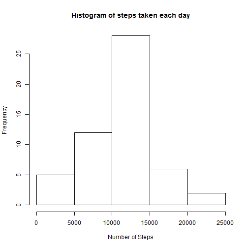
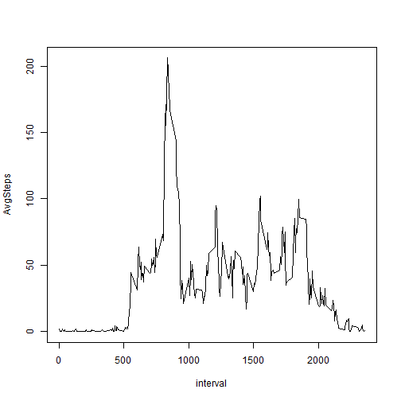
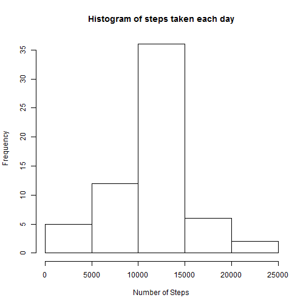
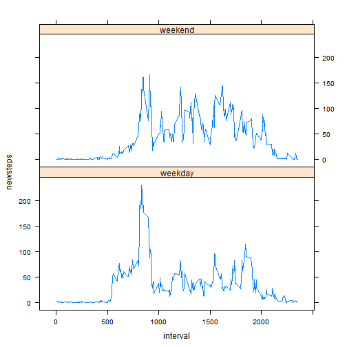

## Loading and preprocessing the data


```r
StepsData <- read.csv("activity.csv")

StepsData$date <- as.Date(StepsData$date)

Sum_StepsDaily <- aggregate(steps~date, data=StepsData, sum, na.rm=TRUE)

colnames(Sum_StepsDaily) <- c("date", "SumSteps")

AVG_StepsInterval <- aggregate(steps~interval, data=StepsData, mean, na.rm=TRUE)
colnames(AVG_StepsInterval) <- c("interval", "AvgSteps")
```

## What is mean total number of steps taken per day?


```r
hist(Sum_StepsDaily$SumSteps, xlab ="Number of Steps", main ="Histogram of steps taken each day")
```

 

```r
mean(Sum_StepsDaily$SumSteps)
```

```
## [1] 10766.19
```

```r
median(Sum_StepsDaily$SumSteps)
```

```
## [1] 10765
```

## What is the average daily activity pattern?


```r
plot(AvgSteps ~ interval, data = AVG_StepsInterval, type = "l")
```

 

```r
max(AVG_StepsInterval$AvgSteps)
```

```
## [1] 206.1698
```

```r
AVG_StepsInterval[which.max(AVG_StepsInterval$AvgSteps), ]$interval
```

```
## [1] 835
```

## Imputing missing values

Calculate and report the total number of missing values in the dataset 


```r
sum(is.na(StepsData$steps))
```

```
## [1] 2304
```

```r
StepsData2 <- merge(StepsData, AVG_StepsInterval, by="interval")
StepsData2$newsteps <- ifelse(is.na(StepsData2$steps), round(StepsData2$AvgSteps), StepsData2$steps )

Sum_StepsDaily2 <- aggregate(newsteps~date, data=StepsData2, sum, na.rm=TRUE)
colnames(Sum_StepsDaily2) <- c("date", "SumSteps")

hist(Sum_StepsDaily2$SumSteps, xlab ="Number of Steps", main ="Histogram of steps taken each day")
```

 

```r
mean(Sum_StepsDaily2$SumSteps)
```

```
## [1] 10765.64
```

```r
median(Sum_StepsDaily2$SumSteps)
```

```
## [1] 10762
```

##4.Make a histogram of the total number of steps taken each day and Calculate and report the mean and median total number of steps taken per day. Do these values ##differ from the estimates from the first part of the assignment? What is the impact of imputing missing data on the estimates of the total daily number of steps?


## Are there differences in activity patterns between weekdays and weekends?


```r
StepsData2$DayType  <- ifelse(weekdays(StepsData2$date)=="Saturday" | weekdays(StepsData2$date)=="Sunday","weekend","weekday")


toplot <- aggregate(newsteps ~ DayType * interval, data=StepsData2, FUN=mean)


library(lattice)
xyplot( newsteps ~ interval | DayType, toplot, layout = c(1, 2), type = "l")
```

 
